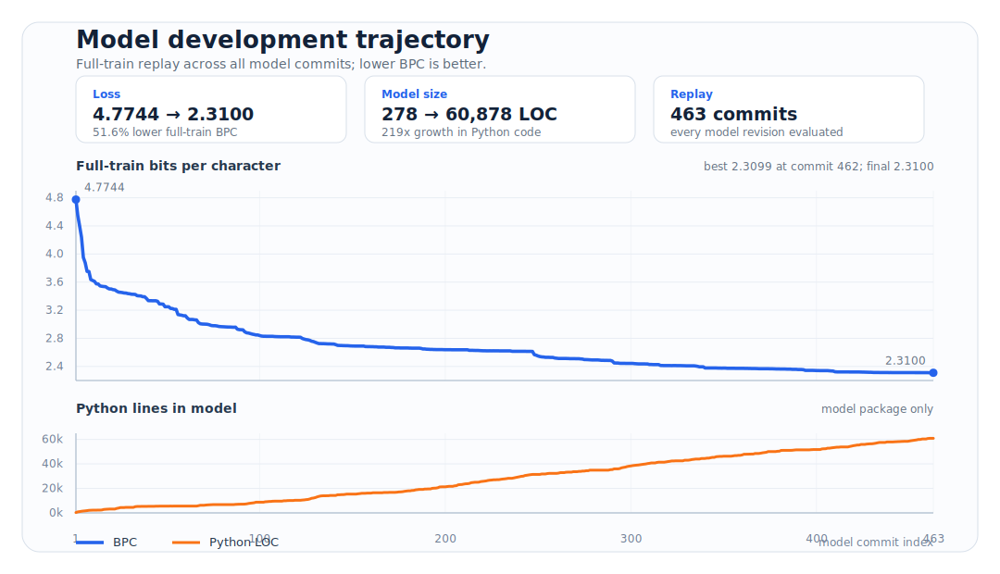

# Tiny Shakespeare CLM

A rules-only character-level language model for Shakespeare-style text.

## Generation Samples

These fixed-seed snippets are selected for texture first, with temperatures
shown in each command. Medium temperatures tend to be the most readable; hotter
samples show more range but also more drift.

**Temperature 0.75**

```text
$ python3 harness.py sample --prefix $'ROMEO:\nBut soft, ' --length 300 --temperature 0.75 --seed 23
ROMEO:
But soft, upon me deep
Are shank, while he that doth banish her firing thou:
I think your father and the lord.

OTHELLO:
Tell think he or is the lies sneered think
In we lord hard, be one think.

CONSTABLE:
You quip, to reach lend.

NORTHUMBERLAND:
Be her in the nognepuve,
The anyoroe ransom mare soft where h
```

**Temperature 0.65**

```text
$ python3 harness.py sample --prefix $'KING HENRY:\nNow is the winter of ' --length 300 --temperature 0.65 --seed 26
KING HENRY:
Now is the winter of the court stretch
We sit test back to the time and mention, so be dress.

GLOUCESTER:
Tail imagine lay uneasy heaven on the clean
Under sand true disciple time,
Our ant be red that labour tyrnpag.

RATCLIFF:
The heart hath on the dark,
And of slumber undertake tremble oberon is here enter
the other
```

**Temperature 0.90**

```text
$ python3 harness.py sample --prefix $'MACBETH:\nIs this a dagger ' --length 360 --temperature 0.90 --seed 6
MACBETH:
Is this a dagger to e
Shout to me open. If the onset hour stubborn
Where lameness the hazard yetplolrigab bones
Afraid. It flee grasses heart Fie tender
Cries, ladies rage the tension throne go
Trench who as man,
thou arrest an immediately heart hath?
The her reach the noble lord beware, relent:
Of twist oasbu utter O As she eyeonfe craoslur.
Angered, but hark, As sore crouc
```

## Training Metrics



Full-train replay across all 463 model commits: BPC fell from `4.7744` to
`2.3100` while the model grew from `278` to `60,878` Python lines.

## Code Policy Optimization

This project does not train a neural network. The model's policy, the function
that maps a rolling character state to a next-character probability
distribution, is written directly in Python.

Optimization happens by changing code instead of updating learned weights. New
state fields, pipeline stages, word-shape rules, syntactic heuristics, semantic
trackers, and logit-bias layers are added under `model_repo/model/`, then
evaluated with the harness using bits per character and fixed-seed text samples.

In other words, the codebase itself is the parameter space. Each improvement is
a policy edit: a change to how the model reads context, updates state, or
chooses the next character distribution.

## Model API

The model lives in `model_repo/model/` and exposes a deliberately small API:

```python
from model import ModelState, advance, predict

state = ModelState()
logprobs = predict(state)
state = advance(state, token_id)
```

`predict(state)` returns natural log-probabilities over the project vocabulary.
`advance(state, token_id)` returns the next immutable `ModelState`. The state is
a frozen Pydantic model, and the update path is a pure pipeline of focused
state-update stages.

## Repository Layout

- `harness.py` - evaluation and sampling CLI for the model.
- `optimizer.py` - long-running agent optimizer that edits `model_repo/model/`.
- `optimizer_prompt.md` - system prompt used by the optimizer.
- `nudges.txt` - live-editable structural prompts injected into optimizer runs.
- `corpus/train.txt` - training corpus used by the harness and vocabulary.
- `model_repo/model/` - model package.
  - `state/schema.py` defines `ModelState`.
  - `advance.py` threads tokens through `pipeline.PIPELINE`.
  - `pipeline/` contains state-update stages.
  - `predict/` contains distribution-bias layers and final composition.
  - `vocab.py` builds the character vocabulary from `corpus/train.txt`.

## Requirements

- Python 3.10+
- `pydantic` for the model state
- `claude_agent_sdk` only if you run `optimizer.py`

There is no packaged dependency file in this repo. For basic harness usage:

```bash
python3 -m pip install pydantic
```

Install the Claude agent SDK separately if you want to run the optimizer.

## Harness Usage

Run commands from the repository root.

Check the model contract:

```bash
python3 harness.py check-distribution
```

Evaluate bits per character on a random training chunk:

```bash
python3 harness.py train-eval-batch --seed 0 --batch-size 2000
```

Evaluate the full training corpus:

```bash
python3 harness.py train-eval-full
```

Generate a sample:

```bash
python3 harness.py sample --prefix $'HAMLET:\nTo be or not to be, ' --length 300 --seed 0
```

View a slice of the training corpus:

```bash
python3 harness.py view-train --offset 0 --length 1000
```

`dev-eval` and `val-eval` are operator-only commands. The dev and validation
splits live outside this directory by design and should not be accessed during
model optimization.

## Model Development

The intended edit surface is `model_repo/model/`.

Common development loop:

1. Run `python3 harness.py check-distribution`.
2. Capture a baseline with `train-eval-batch` across a few seeds.
3. Generate samples with realistic prefixes and inspect quality.
4. Add or adjust state fields, pipeline stages, or predict layers.
5. Re-run the contract check, BPC checks, and samples.

Important invariants:

- `advance()` must not mutate its input state.
- `predict()` must return one log-probability per vocabulary entry.
- `sum(exp(logp))` must stay close to `1.0`.
- Probabilities must remain valid for every state the harness can reach.

## Optimizer

`optimizer.py` starts a long-running Claude agent session with a guard hook that
blocks dev/val access. It streams logs to stdout and writes JSONL logs under
`logs/`.

```bash
python3 optimizer.py
```

The optimizer prompt asks the agent to improve both training BPC and sample
quality, then commit successful improvements. `nudges.txt` can be edited while
the optimizer is running; the process re-reads it before each scheduled nudge.

## Citation

```bibtex
@software{baron_tiny_shakespeare_clm_2026,
  author = {Baron, Jeremy},
  title = {Tiny Shakespeare CLM},
  year = {2026},
  url = {https://github.com/levy-street/tiny-shakespeare-clm},
  note = {Rules-only character-level language model optimized through code policy edits}
}
```
